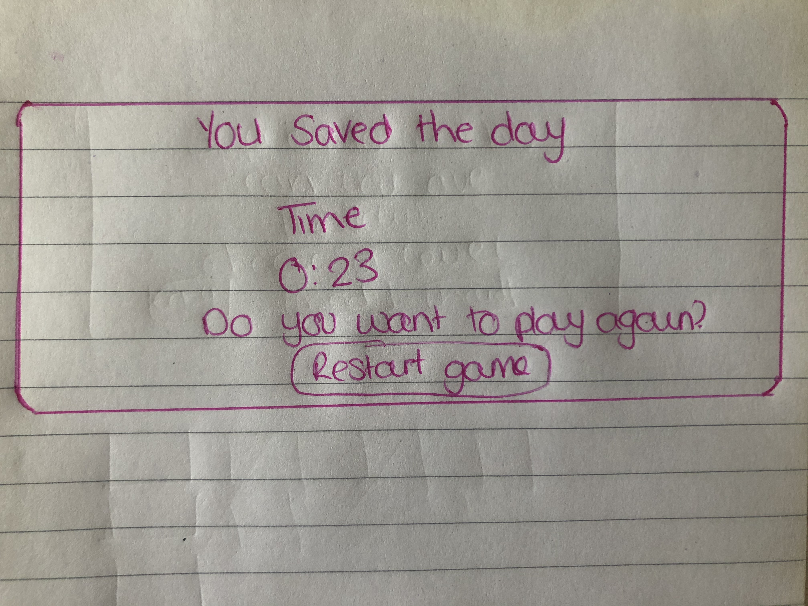

<h1 align="center">
  
</h1>

## Table of Contents
1. [**UX**](#ux)
    - [**Project Goals**](#project-goals)
    - [**Player goals**](#player-goals)
    - [**Developer Goals**](#developer-Goals)
    - [**User Stories**](#user-stories)
    - [**Design choices**](#design-choices)
    - [**Wireframes**](#wireframes)

2. [**Features**](#features)
    - [**Existing Features**](#existing-features)
    - [**Features Left to Implement**](#features-left-to-implement)

3. [**Technologies used**](#technologies-used)

4. [**Testing**](#testing)

5. [**Deployment**](#deployment)
    - [**How to run this project locally**](#how-to-run-this-project-locally)

6. [**Credits**](#credits)
    - [**Content**](#content)
    - [**Media**](#media)
    - [**Code**](#code)
    - [**Acknowledgements**](#acknowledgements)

## UX

### Project Goals

My nieces and nephew were the motivation for me to create a superhero game, I wanted to make it child friendly so that they and other children can play and at the same time have fun!

#### Player goals

The target audience for this game is 3 - 6 years old. 

Players goals are:
- A fun game to play.
- Different superhero characters
- 3 levels
- Easy to use

Superheros is a interactive game as it helps the children with their memory skills, as there are different heros which the children have to match and there are 3 levels which can help increase their memory at a young age whilst they are in the developing stage. 

#### Parental goals

Nowadays parents are reliant on technology to entertain the children as it has become such a big part in our lives, to make sure 

Parents of pre-school children have a large amount of say about what games their children are exposed to, 
therefore parental needs must also be at the forefront of any project designed for children in this age group. 

Parent's goals are:
- The parents goal for this game is to help their child with their memory, by the different levels there are. The children will be engaged as the memory game is based on superheros. 

#### User Stories

As a player aged between 1-5 years old, I want:
1. The game was created to easily navigate around the game as it is aimed for children. 
2. The large button are easy for the children to access for their small fingers. 
4. The ability for the children to play the game and pay attention was important for me, that was the reason why i chose to do superheros as children love them. 

### Design Choices

The overall feel of the game is one that is designed for children to enjoy. The following design choices were made with this in mind:

**Fonts**

- The primary font **Bangers, cursive;** was chosen because it was the closest font that resembled a superhero comic book style. 

**Colours**

- I wanted the colours to reflect on comic books and superhero, the pink strip background reminded me of comic books and the blue card makes it stand out. 

**Styling**

- I have made sure the styling of the game is appealing to the eye by the various colours and the style of the cards that I have used. 

**Backgrounds**

- The background image of the pink stripes, again, mimics a superhero comic book. 

**Card images**

- I decided to use Batman on the cards, as most of the children are familar with Batman and he is one of the famous ones. 

### Wireframes

These wireframes were created by hand. 

## Features
 
### Existing Features

1. **Player info modal**
- Player can choose between "easy", "medium" and "hard" mode
- Once chosen, the cards will appear and the as soon as the player clicks on the card, the timer will start and tracks the amount of moves you take.

2. **Dashboard**
    - The game dashboard contains the time, moves and the cards.

 

4. **Difficulty selection buttons**
    - Players can select from three difficulty levels: Easy (8 cards), Medium (12 cards) and Hard (16 cards).
    - The difficulty buttons are coloured green, yellow and red for users who can't read to tell them apart.
    - Selecting any of these buttons turns any face-up cards back over and reshuffles the cards.

 

10. **Turns counter**
    - I have added a feature whenever the user click on a card, there is a counter which counts it. 

12. **Win modals** 
    - When the user has completed the game a modal will appear, 

13. **Footer tab**
    - A small tab is displayed at the bottom of the website that when clicked pulls up a short footer with developer information on. 

### Features Left to Implement

1. **Improvements to the parental check modal**

In the future more functionality can be added to the parental check modal to: 
    - Randomize the math question and active number to click to prove you are an adult. 
    - if the incorrect answer is given the math question/answer is randomised again. 
    - If the incorrect choice is made 5 times in a row then the modal closes. 

2. **Additional difficulty level**
    - Add level "insane" for older kids to try. 
    - This would only be possible on mobiles if converted into a mobile app, as the full screen would be needed to make enough room for all the cards.

3. **Conversion to a mobile App**
    - If this project were to become commercial the current card pictures would have to be changed to ones commissioned specifically for it, rather than using Disney images.

## Technologies Used

- This project uses HTML, CSS and JavaScript programming languages.
- [JQuery](https://jquery.com)
    - The project uses **JQuery** to simplify DOM manipulation.
- [Gitpod](https://www.gitpod.io/) 
    - Developer used **Gitpod** to create the game in. 
- [Google Fonts](https://fonts.google.com/)
    - The project uses **Google fonts** to style the website fonts.
- [ShutterStock](https://www.shutterstock.com/)
    - All of my images used in the game were from Shutterstock
- [GitHub](https://github.com/)
    - This project uses **GitHub** to store and share all project code remotely. 
    - The new GitHub Projects planner was utilised to plan and keep track of this project. This project plan can be viewed [here](https://github.com/AJGreaves/picflip/projects/1).
- [Illustrator](www.adobe.com/Illustrator)
    - This project used tools in **Illustrator** to edit, crop and save images into png.
- [Timer](https://www.w3schools.com/howto/howto_js_countdown.asp)
    - I used this timer in my project to help time the user on how long it takes the to complete the game.

## Testing 

Testing information can be found in separate [testing.md](testing.md) file

## Deployment

This project was developed using the [Gitpod](https://www.gitpod.io/), committed to git and pushed to GitHub. 

To deploy PicFlip! to GitHub Pages from its [GitHub repository](https://github.com/afratetlay/memory_game), the following steps were taken: 
1. Log into GitHub. 
2. From the list of repositories on the screen, select **AJGreaves/picflip**.
3. From the menu items near the top of the page, select **Settings**.
4. Scroll down to the **GitHub Pages** section.
5. Under **Source** click the drop-down menu labelled **None** and select **Master Branch**
6. On selecting Master Branch the page is automatically refreshed, PicFlip! is now deployed. 
7. Scroll back down to the **GitHub Pages** section to retrieve the link to the deployed website.

The PicFlip project made use of several branches for development, testing and bug fixing. 
The Master Branch has always been the one deployed to GitHUb Pages. When displaying the website life, the developer tries to keep the master branch to optimal code only.
At the moment of submitting this Milestone project the Development Branch and Master Branch are identical. 

## Credits

### Content

- All text in this project was written by the developer.

### Media

#### Images
- The card images of the young superheroes were from [Shutterstock](https://www.shutterstock.com/).

### Code
- Code for the card flip animation taken from this [W3Schools](https://www.w3schools.com/howto/howto_css_flip_card.asp) post.
- Box shadow codes were generated at [CSS matic | box-shadow](https://cssmatic.com/box-shadow).
- Code for filtering through an array for specific values sourced from this [StackOverflow](https://stackoverflow.com/questions/6120931/how-to-count-the-number-of-certain-element-in-an-array) post.
- Code for making images into radio buttons sourced from this [StackOverflow](https://stackoverflow.com/questions/17541614/use-images-instead-of-radio-buttons) post.
- Code for adding the correct prefixes to css was created using [AutoPrefixer](https://autoprefixer.github.io/).
- Function to toggle text in the pull up tab from push to pull taken from this [StackOverflow](https://stackoverflow.com/questions/2155453/jquery-toggle-text) post.

### Acknowledgements

Special thanks to: 
- Mentor - Adegbenga Adeye, who has supported me through the project. 

#### Disclaimer
The content of this website is for the milstone project 2.

Thank you for taking your time to read this and if you haven't please have a go at the game. 

Afra. 