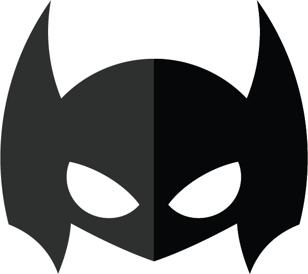

<h1 align="center">
  
</h1>

## Table of Contents
1. [**UX**](#ux)
    - [**Project Goals**](#project-goals)
    - [**Player goals**](#player-goals)
    - [**Developer Goals**](#developer-Goals)
    - [**User Stories**](#user-stories)
    - [**Design choices**](#design-choices)
    - [**Wireframes**](#wireframes)

2. [**Features**](#features)
    - [**Existing Features**](#existing-features)
    - [**Features Left to Implement**](#features-left-to-implement)

3. [**Technologies used**](#technologies-used)

4. [**Testing**](#testing)

5. [**Deployment**](#deployment)
    - [**How to run this project locally**](#how-to-run-this-project-locally)

6. [**Credits**](#credits)
    - [**Content**](#content)
    - [**Media**](#media)
    - [**Code**](#code)
    - [**Acknowledgements**](#acknowledgements)

7. [**Disclaimer**](#disclaimer)

## UX

### Project Goals

My nieces and nephew were the motivation for me to create a superhero game, I wanted to make it child friendly so that they and other children can play and at the same time have fun!

#### Player goals

The target audience for this game is 3 - 6 years old. 

Players goals are:
- A fun game to play.
- Different superhero characters
- 3 levels
- Easy to use

Superheros is a interactive game as it helps the children with their memory skills, as there are different heros which the children have to match and there are 3 levels which can help increase their memory at a young age whilst they are in the developing stage. 

#### Parental goals

Nowadays parents are reliant on technology to entertain the children as it has become such a big part in our lives, to make sure 

Parents of pre-school children have a large amount of say about what games their children are exposed to, 
therefore parental needs must also be at the forefront of any project designed for children in this age group. 

Parent's goals are:
- The parents goal for this game is to help their child with their memory, by the different levels there are. The children will be engaged as the memory game is based on superheros. 

#### Developer and Business Goals

- Well thought out programming that prepares for a child's random and unpredictable use of PicFlip! 
For example, that the game cannot be broken by clicking many areas quickly, or if it is restarted at an unexpected moment. 
- A professional looking first dip into the world of using JavaScript, jQuery and Jasmine. 
- A project the developer is excited to make a part of her portfolio. 

#### User Stories

As a player aged between 1-5 years old, I want:
1. The ability to easily find and understand the controls for the game, so that I can operate them easily. 
2. A large easy to press buttons and controls, so that my young fingers can use on all devices.
3. Audio and/or visual feedback when I play the game, so that I know when I have clicked or not clicked something.
4. The ability to choose from cards with my favourite children’s characters on, so that I am even more engaged in finding them in the game.
5. Positive audio feedback when I complete a step in the game (for example when I find a matching pair of cards), because this increases my enjoyment from playing.
6. Visual icons and images that I recognise, so that I understand when I have achieved something in the game. For example stars out of five, and a trophy for high score.
7. The ability to see my old scores when I return to the game, so I can try to beat them.

As a parent of a player, I want:
1. Levels of difficulty for my child to choose from, so that they are engaged for longer and the game is useable for a wider age range.
2. A visually and operationally appealing game, so that I also have a positive experience when using it with my child.
3. The ability to delete a stored profile, so that I can reset the game for another go, or for another child. 
4. The option to delete a profile to be easy for me to find, but not easy for a child who is randomly pressing buttons to access, so that a profile is not deleted by accident.
5. A mute button to be included, so that the sounds can be switched off when they become annoying. (If only the actual child came with one of those too!).
6. To know who made the game and how I can contact them. 

### Design Choices

The overall feel of the game is one that is designed for children to enjoy. The following design choices were made with this in mind:

**Fonts**

- The primary font **Bangers, cursive;** was chosen because it was the closest font that resembled a superhero comic book style. 

**Colours**

- The primary colour choices of dark and light blue for the logo, titles and text were chosen because they have a clean clear aspect while contrasting each other well.
- Other colours used in the project were taken from the trophy image sourced, using a colour picker in Photoshop to make sure all colours used were consistent across the entire project.

**Styling**

- Cards and container boxes were given rounded corners to continue the child friendly theme, many real life memory cards for children have corners like this. 
- Repeating the same rounded corner pattern throughout the page keeps consistency in design and maintains the feeling that all elements belong together. 

**Backgrounds**

- The background image of the pink stripes, again, mimics a superhero comic book. 

**Card images**

- I decided to use Batman on the cards, as most of the children are familar with Batman and he is one of the famous ones. 

### Wireframes

These wireframes were created by hand. 

## Features
 
### Existing Features

1. **Player info modal**
- Player can choose between "easy", "medium" and "hard" mode
- The game features a timer to keep track of how long it takes to win and reports time on win screen
- When the game ends, a pop-up appears with the elapsed time and a restart button

2. **Dashboard**
    - The game dashboard contains the player info display, difficulty selection, character selection, info, mute and reset buttons. 
    - On mobile devices a chevron arrow is displayed to tell the player to scroll downwards to the game board. 

 

3. **Player info display**
    - At the top of the dashboard the players name is displayed with their chosen avatar. 
    - Underneath this is the display to show their highest score (out of 5 stars) for the currently selected difficulty level. 
    - The star display changes if a different level is selected. 

4. **Difficulty selection buttons**
    - Players can select from three difficulty levels: Easy (8 cards), Medium (12 cards) and Hard (16 cards).
    - The difficulty buttons are coloured green, yellow and red for users who can't read to tell them apart.
    - Selecting any of these buttons turns any face-up cards back over and reshuffles the cards.

5. **Character selection buttons**
    - Players can choose from three different Disney movie characters to display on the memory cards.
    - Selecting any of these buttons turns any face-up cards back over and reshuffles the cards.

6. **Mute button**
    - The mute button switches off all audio in the game. It is represented by a large speaker icon, which switches to one with a cross next to it when active.
 
7. **Reset button**
    - The reset button, represented by a curved arrow, resets the game, when it is pressed the game turns any face-up cards back over, reshuffles them and resets the turns counter back to 0. 
    - It does not reset the difficulty level or characters chosen for the cards. 

8. **Info button**
    - Represented by a large question mark, the info button opens the info modal. 
    - The info modal offers easy to understand instructions on how to play the game. 
    - Underneath how to play instructions there is information on how to open the modal to delete the player’s profile. 
    - The place to click is easy for an adult to see, but not an obvious button to click for a child. 

 

9. **Parental check modal**
    - This modal appears if the correct icon is clicked in the info modal. 
    - It explains that deleting the player profile will remove all game data including high scores. 
    - Then it asks a simple maths question with 9 possible answers to choose from, only if the correct answer is clicked will the player profile be deleted. 
    - All other choices will close the modal when clicked with no further effects to the game.
    - At this point the maths question and correct answer are static. This is a feature I would like to update in the future (see [Features Left to Implement](#Features-left-to-implement) for more information)

10. **Turns counter**
    - Located above the game cards, the turns counter counts the number of turns the player has taken in the current game. 
    - This total is then used to give the player a score out of 5 stars when the game is complete.

11. **Game board and cards**
    - The game board is where the memory cards are displayed. 
    - The cards are laid out in a grid 4 cards wide on medium to large screens, and 3 cards wide on phones to allow the size to remain easy for young fingers to tap on.
    - The number of rows of cards visible changes depending on the difficulty level selected. 

12. **Win modals** 
    - PicFlip! has two possible win modals that pop up when a game is completed. 
    - Both win modals display the number of stars the player won for the game they just played.
    - The standard win modal is launched if the player completed the game, but did not beat their previous high score.
    - The high score win modal is launched for a new high score, along with the number of stars earned the high score win modal also displays a trophy picture.

13. **Footer tab**
    - A small tab is displayed at the bottom of the website that when clicked pulls up a short footer with developer information on. 

### Features Left to Implement

1. **Improvements to the parental check modal**

In the future more functionality can be added to the parental check modal to: 
    - Randomize the math question and active number to click to prove you are an adult. 
    - if the incorrect answer is given the math question/answer is randomised again. 
    - If the incorrect choice is made 5 times in a row then the modal closes. 

2. **Additional difficulty level**
    - Add level "insane" for older kids to try. 
    - This would only be possible on mobiles if converted into a mobile app, as the full screen would be needed to make enough room for all the cards.

3. **Conversion to a mobile App**
    - If this project were to become commercial the current card pictures would have to be changed to ones commissioned specifically for it, rather than using Disney images.

## Technologies Used

- This project uses HTML, CSS and JavaScript programming languages.
- [JQuery](https://jquery.com)
    - The project uses **JQuery** to simplify DOM manipulation.
- [Gitpod](https://www.gitpod.io/) 
    - Developer used **Gitpod** to create the game in. 
- [Google Fonts](https://fonts.google.com/)
    - The project uses **Google fonts** to style the website fonts.
- [ShutterStock](https://www.shutterstock.com/)
    - All of my images used in the game were from Shutterstock
- [GitHub](https://github.com/)
    - This project uses **GitHub** to store and share all project code remotely. 
    - The new GitHub Projects planner was utilised to plan and keep track of this project. This project plan can be viewed [here](https://github.com/AJGreaves/picflip/projects/1).
- [Illustrator](www.adobe.com/Illustrator)
    - This project used tools in **Illustrator** to edit, crop and save images into png.
- [Timer](https://www.w3schools.com/howto/howto_js_countdown.asp)
    - I used this timer in my project to help time the user on how long it takes the to complete the game.

## Testing 

Testing information can be found in separate [testing.md](testing.md) file

## Deployment

This project was developed using the [Gitpod](https://www.gitpod.io/), committed to git and pushed to GitHub. 

To deploy PicFlip! to GitHub Pages from its [GitHub repository](https://github.com/afratetlay/memory_game), the following steps were taken: 
1. Log into GitHub. 
2. From the list of repositories on the screen, select **AJGreaves/picflip**.
3. From the menu items near the top of the page, select **Settings**.
4. Scroll down to the **GitHub Pages** section.
5. Under **Source** click the drop-down menu labelled **None** and select **Master Branch**
6. On selecting Master Branch the page is automatically refreshed, PicFlip! is now deployed. 
7. Scroll back down to the **GitHub Pages** section to retrieve the link to the deployed website.

The PicFlip project made use of several branches for development, testing and bug fixing. 
The Master Branch has always been the one deployed to GitHUb Pages. When displaying the website life, the developer tries to keep the master branch to optimal code only.
At the moment of submitting this Milestone project the Development Branch and Master Branch are identical. 

## Credits

### Content

- All text in this project was written by the developer.

### Media

#### Images
- The card images of the young superheroes were from [Shutterstock](https://www.shutterstock.com/).

### Code
- Code for the card flip animation taken from this [W3Schools](https://www.w3schools.com/howto/howto_css_flip_card.asp) post.
- Box shadow codes were generated at [CSS matic | box-shadow](https://cssmatic.com/box-shadow).
- Code for filtering through an array for specific values sourced from this [StackOverflow](https://stackoverflow.com/questions/6120931/how-to-count-the-number-of-certain-element-in-an-array) post.
- Code for making images into radio buttons sourced from this [StackOverflow](https://stackoverflow.com/questions/17541614/use-images-instead-of-radio-buttons) post.
- Code for adding the correct prefixes to css was created using [AutoPrefixer](https://autoprefixer.github.io/).
- Function to toggle text in the pull up tab from push to pull taken from this [StackOverflow](https://stackoverflow.com/questions/2155453/jquery-toggle-text) post.

### Acknowledgements

Special thanks to: 
- Mentor - Adegbenga Adeye, who has supported me through the project. 

#### Disclaimer
The content of this website is for the milstone project 2.

Thank you for taking your time to read this and if you haven't please have a go at the game. 

Afra. 